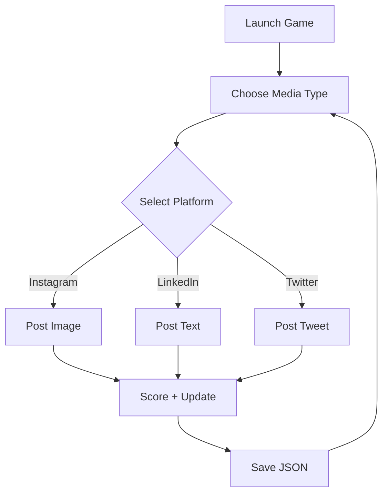

### 🎯 Features

* 🖼️ **Beautiful UI**: Built using `tkinter` and styled for engagement.
* 📱 **Simulates Social Media Posts**: Make text, image, or video posts to multiple platforms.
* 💾 **Auto Save**: Game state is stored and updated using JSON files (`savegame.json`, `zotlife_save.json`).
* 🗂️ **Asset Handling**: Includes custom icons, visuals, and game assets.
* 📦 **Packaged App**: Built into a standalone `.exe` (no need for Python or any setup).

---

### 🗃️ Folder Structure

```
Zot-Life-Survive-the-Week-at-UCI/
├── assets/
│   └── ico.ico               # Custom app icon
├── dist/
│   └── windows/
│       └── ZotLife.exe       # The final Windows executable
├── main.py                   # Main game script
├── main.spec                 # PyInstaller configuration
├── savegame.json             # User save data (optional)
├── zotlife_save.json         # Game config/state (optional)
├── .gitignore
└── README.md
```

---

### 💻 How to Run

#### 🔹 Windows Users:

> 👉 [Download Zot-post `.exe`](https://github.com/omu47/Zot-Life-Survive-the-Week-at-UCI/tree/zotpost/dist/windows)

* No Python required. Just download and double-click to launch.

#### 🔹 Developers:

```bash
git clone https://github.com/omu47/Zot-Life-Survive-the-Week-at-UCI.git -b zotpost
cd Zot-Life-Survive-the-Week-at-UCI
python main.py
```

---

### 🛠️ Build Details (PyInstaller `.spec`)

You're using a PyInstaller `.spec` script to generate a `.exe` file with:

```python
icon=['assets\\ico.ico'],
console=False
```

✅ Hides the console window
✅ Includes icon
✅ Compresses build using `upx=True`

> This ensures a lightweight, portable `.exe` under `dist/windows/`.

---

### 🧠 How the Game Works




---

### 🔀 Git Branches

* `main`: Core development branch (no builds).
* `zotpost`: Includes `.exe`, assets, and extra UI/gameplay logic.

---

### 🧾 License

MIT License © 2025 [omu47](https://github.com/omu47)

---
